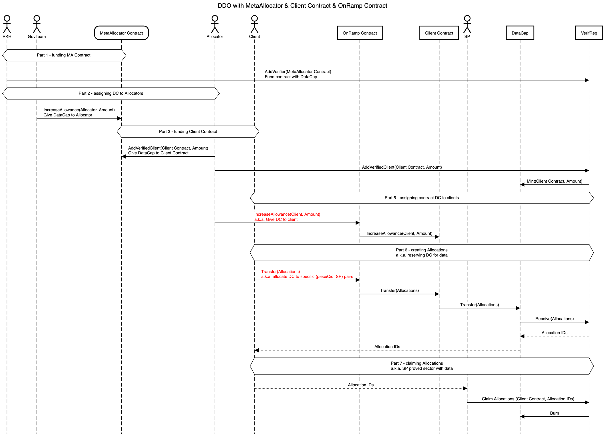

# MetaAllocator only

Compared to [standard DDO](https://github.com/filecoin-project/FIPs/discussions/730), this introduces a MetaAllocator contract. This contracts acts as a Verifier in terms of Verified Registry actor - a.k.a. it gets the allowance to mint DataCap to Clients.

Typical flow is:

1. RKH calls VerifReg to give DC allowance to the MetaAllocator contract
2. Governance Team (a.k.a. MetaAllocator owner) gives Allocators allowance to use the contract to mint DataCap to Clients
3. Allocator calls the MetaAllocator contract to mint DataCap to Clients

Rest is a standard DDO flow.

In addition to standard procedure, the contract enables Governance Team to take away unused allowance from Allocators.

# MetaAllocator & Client Contract

Changes to the previous flow marked in red.

Compared to the previous flow, this introduces a Client Contract. This contracts acts as a client in terms of Verified Registry actor - a.k.a. it gets DataCap from Verifier and can create Allocations with it. This means that in eyes of the VerifReg all DataCap, Allocations, Data etc. belong to the contract, not the real client, which needs to be handled accordingly by all tooling.

Typical flow is:

1. RKH calls VerifReg to give DC allowance to the MetaAllocator contract
2. Governance Team (a.k.a. MetaAllocator owner) gives Allocators allowance to use the contract to mint DataCap to Clients
3. Allocator calls the MetaAllocator contract to mint DataCap to Client **Contract**
4. **Allocator calls the Client Contract to give Client an allowance to use the contract DataCap**
5. Client calls **the Contract** to create VerifReg allocations using the DataCap
6. SP claims the allocations from VerifReg **using Client Contract as the VerifReg Client**

In addition to the standard procedure, the contract enables the Allocator to:

1. Take away unused allowance from Client.
2. Restrict distribution of allocations to SPs (whitelisted SPs and equal distribution)

# MetaAllocator, Client Contract & OnRamp Contract

Changes to the previous flow marked in red.

Compared to the previous flow, this introduces an [OnRamp Contract](https://github.com/fidlabs/contract-onramp). This contracts acts as the sole owner of the Client Contract - so all management actions that were made directly before now must be done via the OnRamp, which will verify authorization and pass them to the Client Contract. Additionally, it enforces rate-limits on how fast allocations to clients can be made.

Typical flow is:

1. RKH calls VerifReg to give DC allowance to the MetaAllocator contract
2. Governance Team (a.k.a. MetaAllocator owner) gives Allocators allowance to use the contract to mint DataCap to Clients
3. Allocator calls the MetaAllocator contract to mint DataCap to Client Contract
4. Allocator calls the **OnRamp** Contract to give Client an allowance to use the Client Contract DataCap
5. Client calls the Client Contract to create VerifReg allocations using the DataCap
6. SP claims the allocations from VerifReg using Client Contract as the VerifReg Client

In addition to the standard procedure, the contract enables an additional "Manager" actor (MetaAllocator Governance Team in practice) to:

1. Execute all actions that can be executed by the Allocator
2. Manage rate-limits
3. Ban clients, restricting any further allowances to them
4. Pause all allocations

